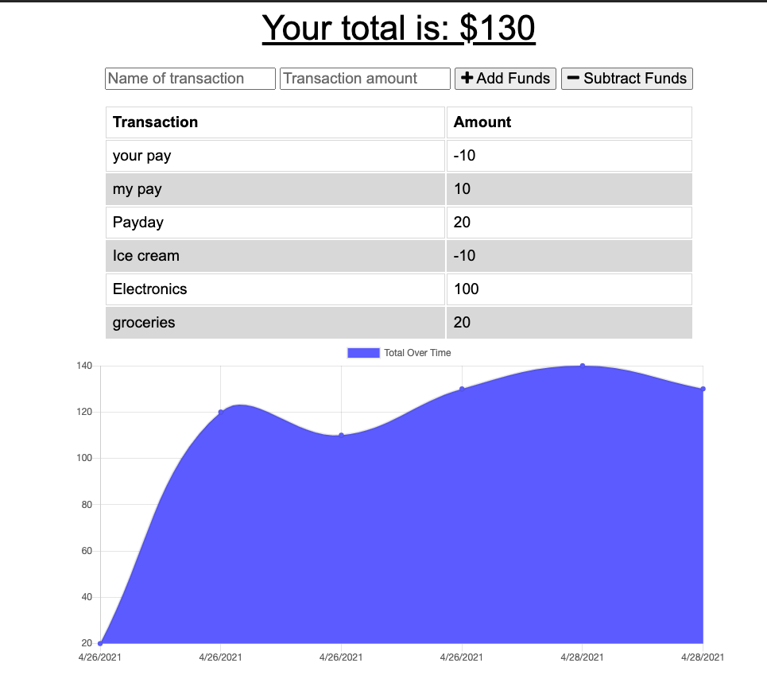

# Budget-Tracker

## Description

* The user will be able to add expenses and deposits to their budget with or without a connection. When entering transactions offline, they should populate the total when brought back online.
Offline Functionality:

  Enter deposits offline

  Enter expenses offline

  When brought back online:

  Offline entries should be added to tracker.
## Technology-Used

* This application utilizes Node JS, Express, IndexedDB and Mongoose DB. This app has full Create functionality for all entered info.

## Screenshots

* Main page screen shot: 

## Deployment

* [This is the link to heroku](https://budgetlartrack.herokuapp.com/)
